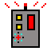
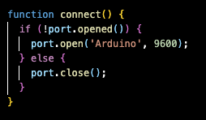
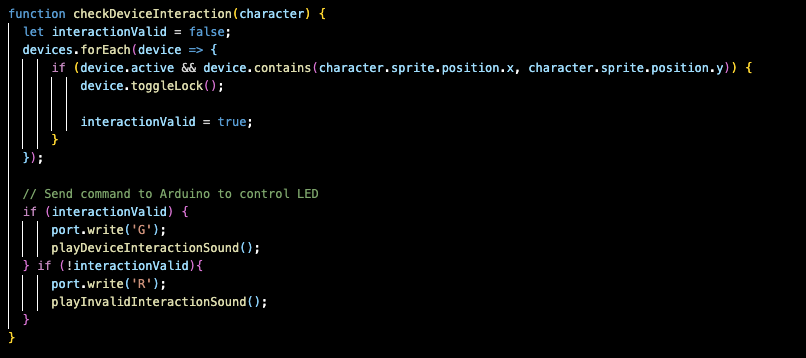

# Final Integration Project Documentation

### By Ethan Palomino

## Project Outline

The main goal of this project was to successfully integrate all of the learned aspects of programming image and graphics, Sound, and physical computing. 

-For programming image and graphics into our project, P5.js and sprite animation was used to cover the graphics feild of our final project. 

-For sound we used the integration of Tone.js, which allowed us to use an oscillator and synth to create sound effects for our project. Additionally, background music was imported into the project. 

-Finally, the physical computing involved with our project featured digital and analog inputs/outputs to give us controls for the game, as well  as signifiers to add interactebility to our project for the user.

## Narrative Description

The idea of the ptoject was to create a simple timed game where our character is working in a security facility, where he has to activate all the devices to secure the area before the time runs out. Using P5 play, A startup, playing state, gameover, and victory screen were all implemented into the project using GameState. This allowed the user to type any keyboard for starting and reseting the game. 

### Graphics and Image implementation

In order to achive this we needed to implement a game reset method that respawned all the devices on the map and reseted the characters spawn position every time the game ended. If the user activates all of the devices on the map before the timer runs out, the victory screen will be displayed. If they run out of time, the game over screen will be displayed. Both screens allowed the user to reset the game if they want to play again. 

The draw() function handles the logic for the screens:

function draw() {
  image(bgImage, 0, 0, width, height);
  switch (game.state) {
      case GameState.Playing:
          image(bgImage, 0, 0, width, height); // Draw background image
          updateGame();
          displayTimer();
          displayScore(); 
          checkGameOver();
          break;
      case GameState.GameOver:
          displayGameOver();
          break;
      case GameState.Start:
          displayStartScreen();
          break;
      case GameState.Victory:
          displayVictoryScreen();
          break;
  }
}

the methods being called in the draw function where handled with the following methods:

If you notice, the code has a resetGame() and displayScore() function for successfully handling the reset game feature, and displaying the score on the playing state. The source code can all be found in sketch.js

#### Startup screen:

#### GameOver Screen

#### Victory Screen

#### Playing State(Gameplay of actual project screenshot)

For our main character, we imported a sprite sheet from the internet that is inspiered from the game Splunky. the name of the character himself is from another game called meatboy. We used this sprite sheet to animate our charater, as well as animations to have him walk around the map. 

There are also "devices" that our character would interact with, once interacted with, the devices would dissapear from the screen. The way to win is to interact with all the devices before the timer runs out. The "device" sprite was drawn with https://www.piskelapp.com/ . 

Characters and devices first had to be loaded into the project using "load" int the preload() function. There was also for loops under the function update() that allowed the devices to spawn anywhere randomly everytime the game is started and reset. Furthermore, there was some logic too add to the score count everytime a device is interacted with. Once the score reaches 10 the game will end, if time runs out and the score isn't 10, game over will be displayed.  

#### preload() Function
2463.png)

This shows how the sprites and devices were loaded into the canvas, along with the animation logic for the main Character. If you notice, animations defines the exact rows/ columns of the characters movement depending on which direction they are walking in. This works by specifying the frames that should be played in row/ column to display the animation of each walking direction.

#### Sprite sheet used:

#### Device sprite

### Sound Design

The sound was first imported in with the help of Tone.js for some sound effects, and some free, no copyright, 16-bit music was imported in for some background music.

First we had to update our index.html file to allow us to use the synth and oscillator from Tone.js. We also had to add Tone.js to our projects library to physically be able to call to it in our code. The actual Tone.js file is under the libraries directory. 

The idea with the sound effects was to indicate if a player activated the device correctly, or did it wrong. A checkmark like sound effect was used to indicate that the device was activated successfully, and a buzzer like soundeffect was used to indicate that the device has not been activated correctly.

When implementing the logic for the sound effects, we had PolySynth help us create sounds by adjusting frequencies on the oscillator. This included setting up the range, type, and ASDR. We then call to the play sound function to create actual audio output and lastly created two methods that help the frequency logic for the InteractionSounds.

The background music was downloaded from https://pixabay.com/music/search/8bit/ and was loaded in with the preload() function. A function was also used to handle the background music, which included setting the volume, infinitely looping the music, and calling userStartAudio() to initiate the music when the player interacts with the browser. 

The original name of the background music is Bit Beats 3, By XtremeFreddy

#### Background Music logic

### Physical Computing

For our physical computing section of the project, the collaboration of the Arduino Uno board, mac & serial ports, and Arduino code setup allowed us to integrate physical hardware to our P5.js project.

First off, the use of a serial port and a connect function helped us integrate Arduino to our javascript project by allowing the open port to control ceratian aspectgs of our project. 

Number readings and serial monitoring helped us let the code know what imputs exactly needed to be read from the arduino code to the p5.js project. This means that the serial monitor was keeping track of all the number readings at all times as long as the port was open and the arduino project code was compiled/ran.

#### connect() function

#### Arduino serial monitoring/number reading

For our Physical analog input, a joystick was used for movement of the main character. The joystick includes an SW pin that allows the joystick to be clicked on for a digital input. Lastly a RGB bulb was used for digital output, it would turn green when a device was successfully interacted with, but turn red if the the player does not interact with it correctly.(Or just presses the SW pin anywhere on the map thats not a device) The main characters sprite has to be hovering directly over the sprite of the device in order to interact with it correctly.

The Joystick to Character movement logic was Highly inspired from Proffesor Andrew webs serial input xample, which showed off how to move a circle with the joystick. The same exact logic was used:

The code demonstrates the movement logic that tells the program which analog input should direct the character in the right direction. 

Apart from that, a simple serial reading was used to tell the project what color the bulb should light up when the SW PIN is pressed:

##### List of Physical hardware used
- 7 jumper wires
- 5 female to male dupont wires
- 1 RGB bulb
- 3 300 resistors
- 1 bread board
- 1 controller board
- 1 USB cable
- 1 USB to USC adapter

#### SetUp of the Arduino Board

Lastly, here is a live demo of the project:

#### LIVE DEMO

In the future, I would love to implement a diffeculty feature, where the games character will move more slower after a device is selected, progressively makeing it harder as you play. Another idea would to only show one device at a time and once you select one, another will spawn in randomly until you reach 10.